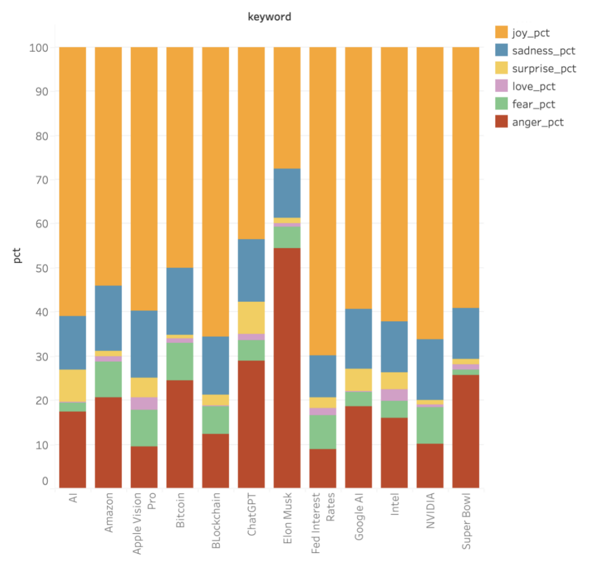

# 🚀 Distributed Real-Time Sentiment Analysis Pipeline

## 🎯 Project Core
This project implements a high-throughput sentiment analysis pipeline for Public Opinion Monitoring. When a user queries a keyword, the system executes a Resource-Aware Workflow:

- **Dynamic Data Fetching**: Utilizes a Reddit API to fetch real-time posts.

- **Smart Routing**: Fetches real-time Reddit posts; if a Redis Cache Hit exists (1h TTL), it returns results in ～200ms.

- **Optimized Inference**: On a cache miss, a Quantized INT8 ONNX model classifies posts into 6 emotions (Joy, Sadness, Anger, Fear, Love, Surprise).

- **Visual Analytics**: Returns a precise percentage breakdown and a Base64-encoded Pie Chart for instant BI visualization.

- **Stability First**: Uses an Idle-Time Sync strategy, only persisting data to PostgreSQL when CPU utilization < 20%, ensuring zero-interference with real-time API requests.


## 📁 Project Structure

```text
.
├── app/
│   ├── app.py                  # FastAPI application & ONNX inference logic
│   └── utils.py                # Helper functions
├── experiment/
│   ├── model_fine_tuning.py    # Fine tuning experiment script
│   ├── export_model.py         # Model export to ONNX and quantization script
├── scripts/
│   ├── keywords.txt            # Seed file for hotword extraction algorithms
│   ├── predict_client.sh       # Test query script
│   ├── stress_test.sh          # Concurrency & latency stress test script
│   ├── cache_warmer.sh         # CPU-aware automatic hot keywords cache script
│   └── sync_kafka_to_pg.py     # CPU-aware Redis to Postgres sync script
├── init_db/            
│   └── init.sql                # Initialize database
├── docker-compose.yml          # Orchestration for API, Kafka, Redis, and PG
├── Dockerfile                  # API container definition
├── requirements.txt            # Python dependencies (optimum, onnxruntime, etc.)
├── .env.example                # Example .env 
├── README.md
└── .gitignore             
```


## 🧠 Model End-to-End Fine-tuning Details
- Base Model: distilbert-base-uncased (Chosen for its balance between performance and parameter efficiency).

- Dataset: Hugging Face `emotion`
    - Task: Multi-class classification (6 classes).

    - Data Split: 16,000 training, 2,000 validation, and 2,000 test samples.

    - Label Distribution: Joy & Sadness are predominant. Surprise & Love are minority classes (handled via weighted loss/balancing during training). 

    - To use this dataset: `from datasets import load_dataset`, `emotions = load_dataset("emotion")`

- Objective: Cross-Entropy Loss with AdamW Optimizer.

- Hyperparameters: 
    - Learning Rate: 3e-5
    - Weight_decay=0.01
    - Batch Size: 8
    - Epochs: 3

- Hardware: 1*NVIDIA A10 on Aliyun PAI cloud platform

- Performance: 93.7% accuracy, 93.7% F1, with ~45 min training time
    - ⬆️ +58.5% over baseline, ⬆️ +30% over hybrid Transformer-scikit-learn approaches


## 🛠️ Post-Training Optimization (ONNX ➕ Quantization)
- Export to ONNX: Converted the PyTorch model to a static graph to remove Python interpreter overhead.

- Compression: Reduced model footprint from 268MB (FP32) to 65MB (INT8).

- Operator Fusion: Optimized the computational graph for high-throughput CPU inference.

- Performance: Achieved a 2x latency reduction (from ~400s to <200s) on CPU-bound environments.

- Memory Safety: Implemented reduced batching size and thread-pool constraints to prevent OOM during high-concurrency spikes.


## 🌟 Key Engineering Highlights
### 1️⃣ Distributed Microservices Architecture
Decoupled Model Storage (S3): Model weights are stored in Amazon S3 and loaded dynamically via boto3, reducing Docker image size and enabling seamless model versioning.

Containerized Orchestration: Fully containerized environment using Docker & ECR, deployed on AWS EC2, managing isolated services for API, Caching, and Persistence.

### 2️⃣ High-Performance Caching (2000x Speedup)
By implementing a Cache-Aside Pattern with Redis, the system bypasses expensive Transformer inference for redundant queries, achieving massive latency reduction.

Stress Test Performance Metrics (~250 posts per keyword): 

| Metric | Model Inference (Cold Start) | Redis Cache Hit (Hot) | Improvement | 
| :--- | :--- | :--- | :--- | 
| CPU Latency | ~40,000 ms | ~200 ms | 2000x | 
| CPU Utilization | 85% - 95% | < 2% | 45x Efficiency | 
| Throughput | ~5 req/s | 10,000+ req/s | Scalability Boost |


### 3️⃣ Intelligent "CPU-Aware" ETL Engine
Designed a robust, Self-Adaptive Sync Script that monitors system health before execution:

- Redis Hot-Words Cache (Threshold < 35%): The system automatically activates the "Hot Words" extraction logic when CPU usage drops below 35%. This preemptively caches high-frequency keywords in Redis to speed up subsequent analytical queries.

- PostgreSQL Synchronization (Threshold < 20%): Data persistence from Redis to PostgreSQL only triggers when the system enters a deep idle state (< 20% CPU). This ensures that heavy Disk I/O and DB handshakes do not cause latency jitter for real-time inference requests.

- Data Integrity (Robustness): Features an automatic "Missing-Data Recovery" logic. It scans Redis keys against the PostgreSQL registry and backfills unsynced records, ensuring 100% data consistency.

### 4️⃣ Dual-Layer Storage Strategy (Efficiency & Durability)
Redis (Speed): Serves as the high-speed "Front-line" for millisecond-level API responses.

PostgreSQL (Durability): Acts as the "Source of Truth" for structured historical data, optimized for OLAP (Online Analytical Processing).


## 📊 Data Visualization (Tableau)
The system connects to PostgreSQL via a Live Connection to provide real-time business insights:

6-Dimensional Sentiment Stacked Bar Chart: Comparative analysis of emotions (Joy, Anger, etc.) across different keywords. 


Confidence vs. Sentiment Scatter Plot: Identifying model uncertainty and outlier detection.


## 🛠️ Tech Stack
**Infrastructure & Orchestration**
- Cloud: AWS (EC2 for hosting, S3 for model versioning, ECR for image registry).

- Containerization: Docker & Docker-Compose (Multi-container orchestration for API, Cache, and DB).

- Data Pipeline: Kafka (Distributed message broker for high-throughput data ingestion).

**Inference Engine & Backend**
- Performance: ONNX Runtime (INT8 Quantized inference) with FastAPI.

- Validation: Pydantic (Strict data modeling and schema enforcement).

- Machine Learning: Hugging Face Transformers, NumPy, Pandas.

**Storage & Analytics**
- Caching: Redis (Real-time result caching and hot-keyword buffering).

- Persistence: PostgreSQL (Relational storage for historical sentiment trends).

- BI & Visualization: Tableau Desktop (Connected to PG for sentiment distribution and keyword frequency dashboards).

## 📡 API Specification
### **Query Format (Input)**
The API expects a `POST` request with a JSON body defining the search criteria:

- **`keyword`** (String): The search term to fetch from the data source (e.g., Twitter/X API).
    
- **`limit`** (Integer): Number of posts to analyze (max 500 recommended for stability).
    
- **`return_plot`** (Boolean): If `true`, the API returns a Base64 encoded string of the sentiment distribution plot.

### **Result Presentation (Output)**
The API returns a comprehensive JSON object designed for seamless integration with frontend dashboards and BI tools like Tableau:
```
{
    "keyword": "AI",
    "count": 500,
    "agg": [
        {
            "label": "joy",
            "pct": 64.0        # percentage in fetched posts
            "avg_score": 0.91  # mean confidence
        },
        {
            "label": "fear",
            "pct": 9.0
            "avg_score": 0.86
        }
        ... (6 categories in total)
    ],
    "plot_base64": "iVBORw0KGgoAAAANSUhEU...", 
    "source": "inference",
    "time": 0.145
}
```
- Output plot example


## ⚙️ Deployment & Usage
- Configure Environment: Populate .env.example with AWS credentials and Database URIs.

- Infrastructure Up: `docker-compose up -d`

- Model Loading: The system automatically pulls the latest ONNX weights from S3 on startup.

- Quick Start running analysis: 
    - Analyze ~250 posts about "AI" (Default): `./scripts/predict_client.sh`
    - Start concurrent burst of multiple users: `./scripts/stress_test.sh`


